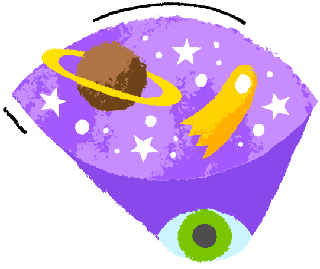

<h1 align="center">
    Space Slight News
    
</h1>

  <a href="#-projeto">Projeto</a>&nbsp;&nbsp;&nbsp;|&nbsp;&nbsp;&nbsp;
  <a href="#-tecnologias">Tecnologias</a>&nbsp;&nbsp;&nbsp;|&nbsp;&nbsp;&nbsp;
  <a href="#books-documentação">Documentação</a>

## 💻 Projeto

Fullstack Challenge 🏅 2021 - Space Flight News

## 🚀 Tecnologias

Esse projeto foi desenvolvido com as seguintes tecnologias:

- [Laravel](https://laravel.com/)
- [VueJS 3](https://vuejs.org/)

## :books: Documentação
Para a execução do projeto é necessário iniciar separadamente
- [Back-End](backend/README.md)
- [Front-End](frontend/README.md)
